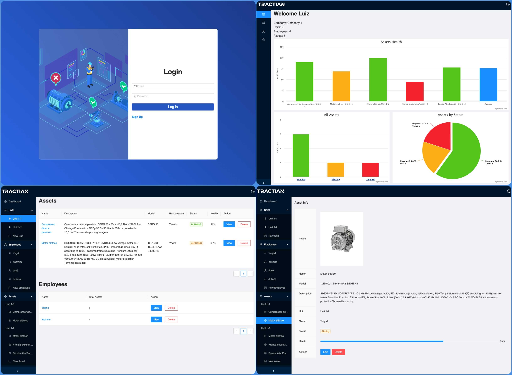

<p align="center">
  <a href="https://github.com/lgsfarias/tractian-challenge-front">
    
  </a>

  <h3 align="center">
    Tractian Challenge
  </h3>
  <p align="center">
    Assets management system
    <br />
    <a href="https://github.com/lgsfarias/tractian-challenge-front"><strong>Explore the docs »</strong></a>
    <br />
</p>

<br/>

<br/><br/>

<br/>

## Built With

Web application to financial control.


<br/>

## Routes

```
- /
  - Route to Login
- /home
  - Route to homepage
- /units/:id
  - Route to unit page
- /assets/:id
  - Route to asset page
```

<br/>

## Usage

To run this project, you will need to install [Node.js](https://nodejs.org/en/).

Clone the repository:

```bash
git clone https://github.com/lgsfarias/tractian-challenge-front.git
```

Access the project folder:

```bash
cd tractian-challenge-front
```

Fill the .env following the .env.example file

```bash
cp .env.example .env
```

Install dependencies:

```bash
npm install
```

Run the project:

```bash
npm run dev
```

<br/>

## API Repository

<a href="https://github.com/lgsfarias/tractian-challenge-back" target="_blank">API repository</a>

<br/>

## Contact

<div>
  <a href="https://www.linkedin.com/in/lgsfarias" target="_blank"></a>
  <a href = "mailto:lgsfarias.dev@gmail.com"></a>
</div>
